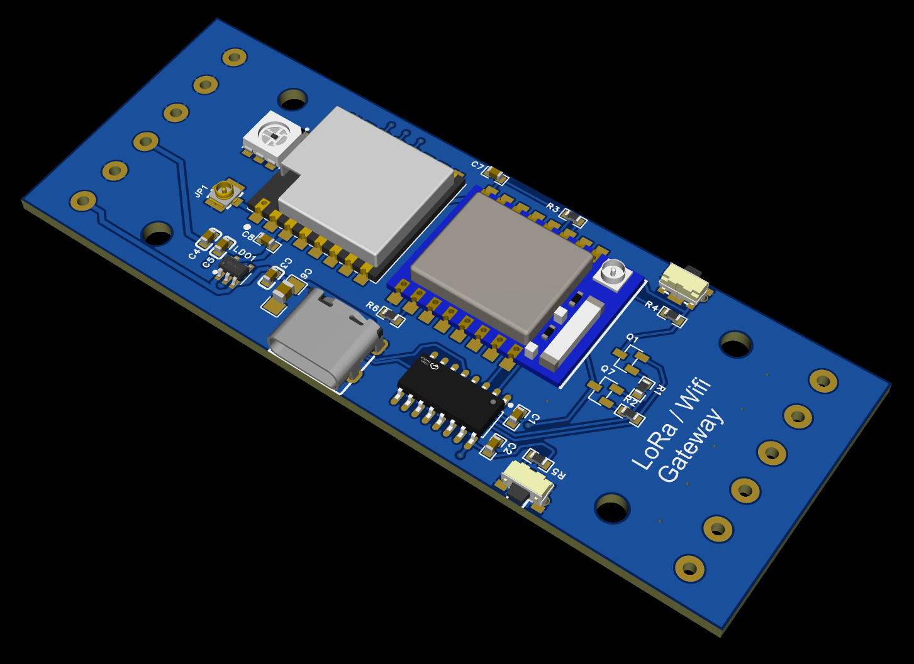

# Esp8266-LoRa-Gateway

Custom PCB and software for WiFi(ESP8266) to LoRa(Ra-01) gateway. This is meant to fit in a [DMB-4770 enclosure](https://www.digikey.com/en/products/detail/bud-industries/DMB-4770/2499326?gclsrc=aw.ds&gad_source=1&gad_campaignid=17922795960&gbraid=0AAAAADrbLliLALWqXMvqAjymSpm62XcV1&gclid=Cj0KCQjw94bTBhDQARIsAN3vv0ymIrAf8-c34imw-3O3CEBacBJsq8vE9WuR0ZiFMQMXCZOAnRCBhwAaAlsuEALw_wcB).



## 📁 Repository Structure

```text
Esp8266-LoRa-Gateway/
├── docs/                    # Datasheets, schematics, and reference manuals
├── esp-gateway-project/     # ESP8266 Project
└── gerbers/                 # PCB Fab files
```

## 🔌 Hardware Pinout

The PCB bridges the **ESP8266**, an **Ai-Thinker Ra-01 LoRa Module** (SX1278), and an **SK9822 RGB LED** indicator.

### 📡 Ra-01 LoRa Module (SPI)

| ESP8266 GPIO | NodeMCU Pin | Ra-01 Pin | Function |
| :--- | :--- | :--- | :--- |
| **GPIO 14** | D5 | SCK | SPI Clock |
| **GPIO 12** | D6 | MISO | SPI Master In Slave Out |
| **GPIO 13** | D7 | MOSI | SPI Master Out Slave In |
| **GPIO 5** | D1 | NSS / CS | Chip Select |
| **GPIO 4** | D2 | RST | Hardware Reset |

### 💡 SK9822 Addressable RGB LED

| ESP8266 GPIO | NodeMCU Pin | SK9822 Pin | Function |
| :--- | :--- | :--- | :--- |
| **GPIO 2** | D4 | DATA | Serial Data Input |
| **GPIO 16** | D0 | CLK | Serial Clock Input |

## 📖 Developer Guides

* **💻 [SW Dev Environment Setup](docs/build-instructions.md)** — Build instructions

